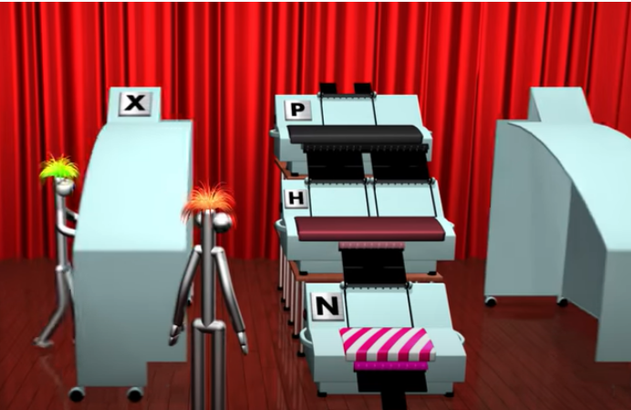

---

layout: post
title:  "alan turing의 정지문제"
---

# **Alan turing의 정지문제**

위 사진을 보면 P,H,N,X기계가 있습니다.

P기계는 입력값을 두개로 복사해 반환합니다

H기계는 기계의 청사진과 청사진 기계에 넣을 입력값을 입력받아 기계의 작동여부를 반환합니다

N기계는 멈춤을 입력받을 시 멈추지않고 멈추지않음을 입력받을시 멈추게 됩니다

위 기계들을 다 묶어놓은것을 X기계라고 합니다

제가 이해한 바로는 H기계가 청사진을 입력받았을시 만약 “청사진을 입력 받았을 시 멈춤”을 반환한다면 N기계는 H기계의 값을 입력받아 X기계를 동작시킨다  

->  ‘X는 멈추지 않는데 H기계가 멈춤’=모순

만약 “청사진을 입력 받았을 시 멈추지 않음”을 반환한다면 N기계는 H기계의 값을 입력받아 X기계를 멈춘다

->  ‘X는 멈추는데, H가 멈추지 않음’=모순

 

따라서 두가지 상황 모두에서 모순이 발생하기 때문에 기계는 모든 것을 해결 할 수 없다고 한다는것을 알것 같습니다.

위 문제를 프로그램에 직접 적용해서 증명하는 방법이 궁금하여 직접 찾아보았습니다.

정지문제를 판별하는 알고리즘 : stop_problem(p,i)라고 설정을 한 후     # p = 프로그램 , i =임의의 입력

function check(p){  

​	if (stop_problem(p,p) == false)  #  입력에 p프로그램을 넣어보았다

​		return true;

​	else

​		infinite loop;

}

만약에 check(check);의 값이 true가 나온다고 가정해보자  

위 값이 true가 나오려면 입력값인 (check)프로그램은 무한루프에 빠져야한다.  그렇다면 check(p)값이 무한루프로 결과값이 나와야한다는 것인데 그러려면 p프로그램이 무한루프가 아니여야한다.

따라서 p프로그램은 무한루프가 아닌데 무한루프여야true값이 나오는 모순적인 상황이 발생하게 된다.

위와 같이 프로그램을 직접 눈으로 보면서 생각을 정리해보니 정지문제가 왜 모순이 발생할 수밖에 없는지 확실하게 이해한것 같다.
