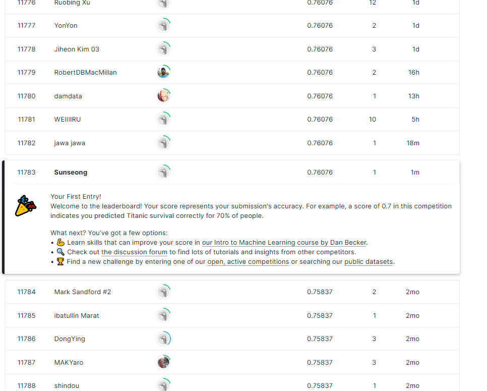

**타이타닉 생존자 예측**

https://www.kaggle.com/c/titanic를 들어가보면 1912년 침몰사고로 2224명중 1502명이 사망한 타이타닉 침몰사고의 생존자를 예측하는 모델을 만들어 타이타닉 머신러닝 경진대회에 참가할 수 있다.

이 경진대회에 target(목표)은 어떤 사람들이 생존 할 가능성이 높은가? 를 해결해줄 수 있는 예측 모델을 구축하는것이다.

이러한 예측에는 이름,성별,나이 등 승객의 여러 데이터를 활용하게된다.

먼저 타이타닉의 데이터를 불러와보자

```python

# This Python 3 environment comes with many helpful analytics libraries installed
# It is defined by the kaggle/python Docker image: https://github.com/kaggle/docker-python
# For example, here's several helpful packages to load

import numpy as np # linear algebra
import pandas as pd # data processing, CSV file I/O (e.g. pd.read_csv)

# Input data files are available in the read-only "../input/" directory
# For example, running this (by clicking run or pressing Shift+Enter) will list all files under the input directory

import os
for dirname, _, filenames in os.walk('/kaggle/input'):
    for filename in filenames:
        print(os.path.join(dirname, filename))

# You can write up to 20GB to the current directory (/kaggle/working/) that gets preserved as output when you create a version using "Save & Run All" 
# You can also write temporary files to /kaggle/temp/, but they won't be saved outside of the current session
```


```python
train_data = pd.read_csv('../input/titanic/train.csv')
test_data = pd.read_csv('../input/titanic/test.csv')
```

마지막에 예측 결과를 확인할때 PassengerID데이터를 사용해야 하기 때문에 미리 테스트데이터를 복사해둔다.


```python
test = test_data.copy()
```

head()를 사용해 데이터를 잘 불러왔는지 확인해준다


```python
#훈련셋 맨위의 몇행 확인
train_data.head()
```

PassengerId열을 인덱스 열로 명시적으로 설정한다


```python
train_data = train_data.set_index("PassengerId")
test_data = test_data.set_index("PassengerId")
```

데이터가 어느정도 누락되었는지 확인해본다


```python
train_data.info()
```


```python
train_data[train_data["Sex"]=="female"]["Age"].median()
```

수치속성을 살펴본다


```python
train_data.describe()
```


```python
#타겟이 0 또는 1인 정보 확인해보기
train_data["Survived"].value_counts()
```

범주적 속성을 살펴본다


```python
train_data["Pclass"].value_counts()
```


```python
train_data["Sex"].value_counts()
```


```python
train_data["Embarked"].value_counts()
```

수치형 속성을 위한 파이프라인을 구축한다


```python
from sklearn.preprocessing import StandardScaler
from sklearn.pipeline import Pipeline
from sklearn.impute import SimpleImputer

num_pipeline = Pipeline([
        ("imputer", SimpleImputer(strategy="median")),
        ("scaler", StandardScaler())
    ])
```

범주적 속성을 위한 파이프라인을 구축한다


```python
from sklearn.preprocessing import OrdinalEncoder, OneHotEncoder
```


```python
cat_pipeline = Pipeline([
        ("ordinal_encoder", OrdinalEncoder()),    
        ("imputer", SimpleImputer(strategy="most_frequent")),
        ("cat_encoder", OneHotEncoder(sparse=False)),
    ])
```

마지막으로, 위에 수치형 파이프라인과 범주형 파이프라인 결합한다


```python
from sklearn.compose import ColumnTransformer

num_attribs = ["Age", "SibSp", "Parch", "Fare"]
cat_attribs = ["Pclass", "Sex", "Embarked"]

preprocess_pipeline = ColumnTransformer([
        ("num", num_pipeline, num_attribs),
        ("cat", cat_pipeline, cat_attribs),
    ])
```


```python
X_train = preprocess_pipeline.fit_transform(train_data)
X_train
```


```python
y_train = train_data["Survived"]

```

분류기를 훈련할 준비가 끝났으니 RandomForestClassifier부터 시작해본다


```python
from sklearn.ensemble import RandomForestClassifier
forest_clf = RandomForestClassifier(n_estimators=100, random_state=42)
forest_clf.fit(X_train, y_train)
```


```python
#모델 훈련한 것으로 테스트셋 예측에 활용하기
X_test = preprocess_pipeline.transform(test_data)
y_pred = forest_clf.predict(X_test)

```

예측 결과를 csv파일로 만들어 경진대회에 제출해보고 등수를 확인해본다


```python
from sklearn.model_selection import cross_val_score

forest_scores = cross_val_score(forest_clf, X_train, y_train, cv=10)
forest_scores.mean()
```


```python
test.info()
```


```python
submission = pd.DataFrame({
        "PassengerId": test["PassengerId"],
        "Survived": y_pred
    })
submission.to_csv('./submission.csv', index=False)
```

캐글사이트 타이타닉 경진대회에 csv파일을 제출해본 결과 11783등이라는것을 확인해볼 수 있다!


