**ML model을 사용하여 웹앱을 만들어보자!

'pickle'훈련모델과 Flask app을 어떻게 사용하는지 배울 것이다.

**고려사항
- 모바일 앱을 구축 하거나 IoT 컨텍스트에서 모델을 사용해야 하는 경우 TensorFlow Lite를 사용하고 안드로이드나 iOS 앱에서 모델을 사용할 수 있다.
- 모델이 cloud나 locally에서 reside하는가
- 앱이 오프라인으로 작동하는가
- 모델을 훈련할때 어떤 기술을 사용하는가 (TensorFlow, PyTorch, Lobe.ai or Azure Custom Vision)

**도구

Flask와 pickle 이 필요하다
Flask란 창조자에 의해 마이크로프레임워크로 정의되며 파이썬과 templationg 엔진을 사용하여 웹페이지의 기본기능을 제공한다.
pickle이란 객채 구조를 직렬화 혹은 직렬화 해제를 하는 파이썬 모델이다.

**연습

이 연습에서는 NUFORC가 수집한 80000개의 UFO 목격 데이터를 사용할것이다.


```python
import pandas as pd
import numpy as np

ufos = pd.read_csv('ufos.csv')
ufos.head()
```


<div>
<style scoped>
    .dataframe tbody tr th:only-of-type {
        vertical-align: middle;
    }

    .dataframe tbody tr th {
        vertical-align: top;
    }

    .dataframe thead th {
        text-align: right;
    }
</style>
<table border="1" class="dataframe">
  <thead>
    <tr style="text-align: right;">
      <th></th>
      <th>datetime</th>
      <th>city</th>
      <th>state</th>
      <th>country</th>
      <th>shape</th>
      <th>duration (seconds)</th>
      <th>duration (hours/min)</th>
      <th>comments</th>
      <th>date posted</th>
      <th>latitude</th>
      <th>longitude</th>
    </tr>
  </thead>
  <tbody>
    <tr>
      <th>0</th>
      <td>10/10/1949 20:30</td>
      <td>san marcos</td>
      <td>tx</td>
      <td>us</td>
      <td>cylinder</td>
      <td>2700.0</td>
      <td>45 minutes</td>
      <td>This event took place in early fall around 194...</td>
      <td>4/27/2004</td>
      <td>29.883056</td>
      <td>-97.941111</td>
    </tr>
    <tr>
      <th>1</th>
      <td>10/10/1949 21:00</td>
      <td>lackland afb</td>
      <td>tx</td>
      <td>NaN</td>
      <td>light</td>
      <td>7200.0</td>
      <td>1-2 hrs</td>
      <td>1949 Lackland AFB&amp;#44 TX.  Lights racing acros...</td>
      <td>12/16/2005</td>
      <td>29.384210</td>
      <td>-98.581082</td>
    </tr>
    <tr>
      <th>2</th>
      <td>10/10/1955 17:00</td>
      <td>chester (uk/england)</td>
      <td>NaN</td>
      <td>gb</td>
      <td>circle</td>
      <td>20.0</td>
      <td>20 seconds</td>
      <td>Green/Orange circular disc over Chester&amp;#44 En...</td>
      <td>1/21/2008</td>
      <td>53.200000</td>
      <td>-2.916667</td>
    </tr>
    <tr>
      <th>3</th>
      <td>10/10/1956 21:00</td>
      <td>edna</td>
      <td>tx</td>
      <td>us</td>
      <td>circle</td>
      <td>20.0</td>
      <td>1/2 hour</td>
      <td>My older brother and twin sister were leaving ...</td>
      <td>1/17/2004</td>
      <td>28.978333</td>
      <td>-96.645833</td>
    </tr>
    <tr>
      <th>4</th>
      <td>10/10/1960 20:00</td>
      <td>kaneohe</td>
      <td>hi</td>
      <td>us</td>
      <td>light</td>
      <td>900.0</td>
      <td>15 minutes</td>
      <td>AS a Marine 1st Lt. flying an FJ4B fighter/att...</td>
      <td>1/22/2004</td>
      <td>21.418056</td>
      <td>-157.803611</td>
    </tr>
  </tbody>
</table>
</div>


ufos 데이터를 새로운 제목의 작은 데이터프레임으로 변환시킨다.


```python
ufos = pd.DataFrame({'Seconds': ufos['duration (seconds)'], 'Country': ufos['country'],'Latitude': ufos['latitude'],'Longitude': ufos['longitude']})

ufos.Country.unique()
```


    array(['us', nan, 'gb', 'ca', 'au', 'de'], dtype=object)


이제 null값을 제거하여 우리가 처리해야할 데이터의 양을 줄이고 1~60초의 중요한 sighthing를 입력한다.


```python
ufos.dropna(inplace=True)
ufos = ufos[(ufos['Seconds'] >= 1) & (ufos['Seconds'] <= 60)]
ufos.info()
```

    <class 'pandas.core.frame.DataFrame'>
    Int64Index: 25863 entries, 2 to 80330
    Data columns (total 4 columns):
     #   Column     Non-Null Count  Dtype  
    ---  ------     --------------  -----  
     0   Seconds    25863 non-null  float64
     1   Country    25863 non-null  object 
     2   Latitude   25863 non-null  float64
     3   Longitude  25863 non-null  float64
    dtypes: float64(3), object(1)
    memory usage: 1010.3+ KB
    

사이킷런의 LabelEncoder를 사용하여 텍스트열을 숫자로 바꾸자


```python
from sklearn.preprocessing import LabelEncoder

ufos['Country'] = LabelEncoder().fit_transform(ufos['Country'])

ufos.head()
```


<div>
<style scoped>
    .dataframe tbody tr th:only-of-type {
        vertical-align: middle;
    }

    .dataframe tbody tr th {
        vertical-align: top;
    }

    .dataframe thead th {
        text-align: right;
    }
</style>
<table border="1" class="dataframe">
  <thead>
    <tr style="text-align: right;">
      <th></th>
      <th>Seconds</th>
      <th>Country</th>
      <th>Latitude</th>
      <th>Longitude</th>
    </tr>
  </thead>
  <tbody>
    <tr>
      <th>2</th>
      <td>20.0</td>
      <td>3</td>
      <td>53.200000</td>
      <td>-2.916667</td>
    </tr>
    <tr>
      <th>3</th>
      <td>20.0</td>
      <td>4</td>
      <td>28.978333</td>
      <td>-96.645833</td>
    </tr>
    <tr>
      <th>14</th>
      <td>30.0</td>
      <td>4</td>
      <td>35.823889</td>
      <td>-80.253611</td>
    </tr>
    <tr>
      <th>23</th>
      <td>60.0</td>
      <td>4</td>
      <td>45.582778</td>
      <td>-122.352222</td>
    </tr>
    <tr>
      <th>24</th>
      <td>3.0</td>
      <td>3</td>
      <td>51.783333</td>
      <td>-0.783333</td>
    </tr>
  </tbody>
</table>
</div>


**모델 만들기

이제 훈련셋과 테스트셋으로 나누자
X에 세가지 특성을 선택하여 들어가고 y에는 Country가 들어간다.


```python
from sklearn.model_selection import train_test_split

Selected_features = ['Seconds','Latitude','Longitude']

X = ufos[Selected_features]
y = ufos['Country']

X_train, X_test, y_train, y_test = train_test_split(X, y, test_size=0.2, random_state=0)
```

로지스틱 회귀를 사용하여 모델을 훈련한다


```python
from sklearn.metrics import accuracy_score, classification_report
from sklearn.linear_model import LogisticRegression
model = LogisticRegression(max_iter=1000)
model.fit(X_train, y_train)
predictions = model.predict(X_test)

print(classification_report(y_test, predictions))
print('Predicted labels: ', predictions)
print('Accuracy: ', accuracy_score(y_test, predictions))
```

                  precision    recall  f1-score   support
    
               0       1.00      1.00      1.00        41
               1       0.85      0.47      0.60       250
               2       1.00      1.00      1.00         8
               3       1.00      1.00      1.00       131
               4       0.97      1.00      0.98      4743
    
        accuracy                           0.97      5173
       macro avg       0.96      0.89      0.92      5173
    weighted avg       0.97      0.97      0.97      5173
    
    Predicted labels:  [4 4 4 ... 3 4 4]
    Accuracy:  0.9702300405953992
    

정확도는 약 96%로 나쁘지 않게 나왔다.
우리가 만든 모델은 위도 및 경도에서 국가를 추론할 수 있을 만큼 혁명적이지는 않지만 웹 앱에서 모델을 사용하기엔 좋은 연습이다.

**모델을 'pickle'하기

이제 모델을 'pickle'해보자. pickle이 완료되면 pickle 모델을 로드하여 초, 위도 및 경도 값이 포함된 샘플 데이터 배열과 비교하여 테스트한다.


```python
import pickle
model_filename = 'ufo-model.pkl'
pickle.dump(model, open(model_filename,'wb'))

model = pickle.load(open('ufo-model.pkl','rb'))
print(model.predict([[50,44,-12]]))
```

    [3]
    

    C:\Users\SSS\anaconda3\lib\site-packages\sklearn\base.py:450: UserWarning: X does not have valid feature names, but LogisticRegression was fitted with feature names
      warnings.warn(
    

**Flask app만들기

이제 모델을 불러오고 비슷한 결과를 만들어내기 위해 Flask app을 만들 수 있다.

ufo-model.pkl파일이 있는곳에 notebook.ipynb파일 옆에 web-app폴더를 만든다

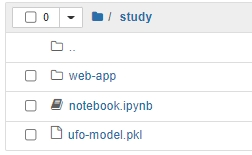
그 후에 web-app폴더 안에 static, templates 폴더를 생성하고 static폴더 안에는 css폴더까지 추가해준다.
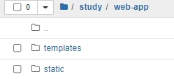
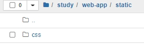

web-app폴더에 requirements.txt파일을 추가한다.
requirements.txt파일에는 <br/>
scikit-learn <br/>
pandas     <br/>
numpy        <br/>
flask         <br/>
를 입력한다.

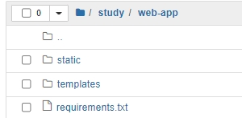

터미널로 web-app폴더를 연다

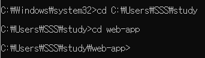

pip install을 사용해 requirements.txt를 설치한다

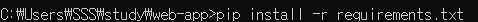

web-app에 app.py만들기

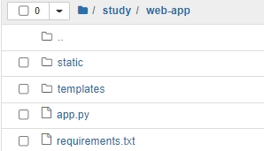

templates에 index.html만들기

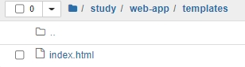

static/css폴더에 styles.css만들기

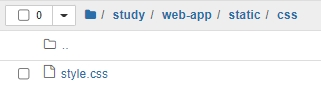

python app.py를 입력해 web 주소를 생성후 브라우저에서 주소를 입력한다.

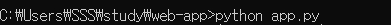
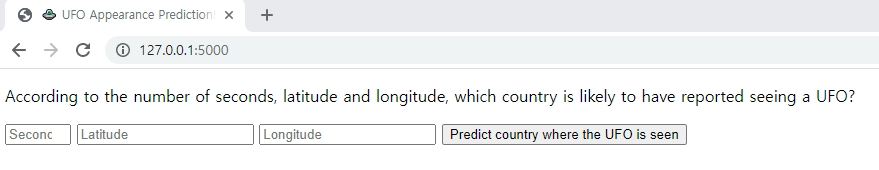


연습에서 사용한 50,44,-12를 입력해본다.

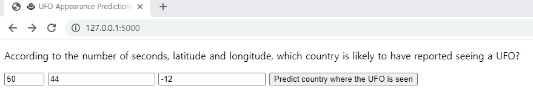

결과값으로 3 UK가 나오는 것을 확인해볼 수 있다!

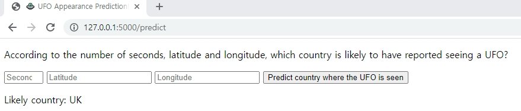
